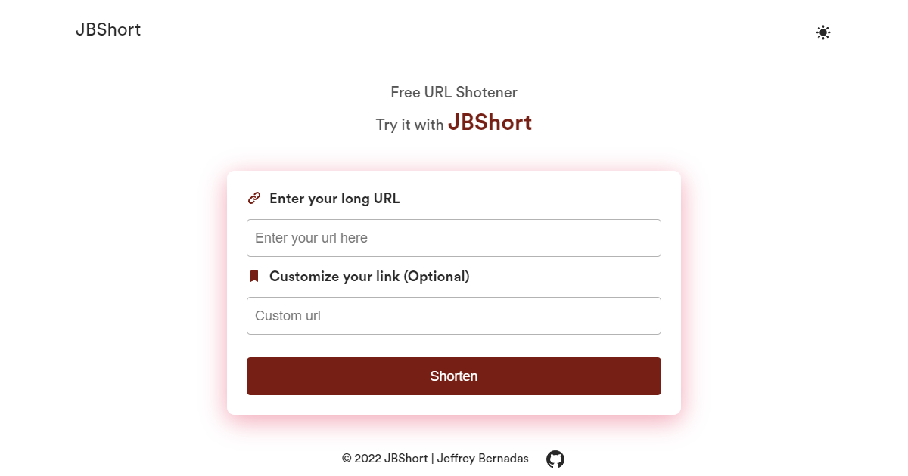

<h1 align="center"><a href='https://www.jbshort.xyz/' target='_blank' rel='noreferrer'>JBShort</a></h1>

 A free URL shortener web app with customizable short URL. Click<a href="https://www.jeffreybernadas.tech/jbshort" target="_blank" rel='noreferrer'> here </a>to learn more.

## ⚒️ Built with the following technologies:

<ul>
    <li>React.js</li>
    <li>Styled Components</li>
    <li>Node.js</li>
    <li>Express.js</li>
    <li>MongoDB</li>
    <li>Framer Motion</li>
    <li>Heroku 🚀</li>
</ul>

## ✨ Features

<ul>
    <li>Shorten any URL.</li>
    <li>The short URL can be customized.</li>
    <li>With theming support (Light/ Dark).</li>
    <li>A redirect page with animation.</li>
    <li>A 404 page when link is expired, invalid, or does not exist.</li>
    <li>Mobile Responsive.</li>
</ul>
